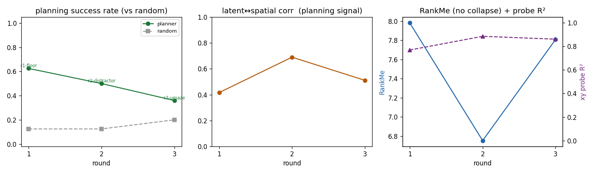
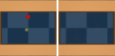
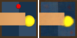
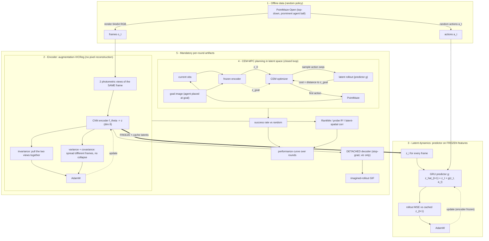

# jepa-wm

**A low-compute, JEPA-style world model that plans in latent space — trained on a laptop.**


Most pixel-based world models spend their compute on a **decoder** that reconstructs
every future pixel. JEPA-style models drop that: they learn dynamics by predicting the
**next latent** in representation space and never reconstruct pixels for control. No
decoder in the control loop means a small model — trainable on an Apple-Silicon laptop
with PyTorch-MPS in a couple of minutes.

This repo builds the smallest honest version and **closes the loop**:

> encode pixels → roll the latent forward → plan with CEM-MPC in latent space →
> measure the **real** success rate in the simulator.

A *detached* decoder exists only so humans can **see** what the model imagines — it is
stop-gradient and never trains the world model.

## Capability ladder (3 verified rounds)

Each round is a **different, harder task** — every round diverges on *mechanism* and is
verified by the real planning success rate beating a random baseline. Success isn't
comparable across rounds (the tasks differ); the consistent signal is **planner ≫ random**
on a new capability, plus rising representation quality (corr / probe R²).

| round | task / challenge | planner | random | latent↔spatial corr | mechanism added |
|---|---|---:|---:|---:|---|
| **1** floor | open maze, big ball — *does planning work at all?* | **0.62** | 0.12 | 0.42 | aug-VICReg encoder + frozen GRU predictor + CEM-MPC |
| **2** distractor | open maze, **small ball** (~3 px in static clutter) | **0.50** | 0.12 | **0.69** | spatial-softmax + multi-step inverse dynamics (ACRO) |
| **3** obstacle | **UMaze** — goal behind a wall, must detour | **0.36** | 0.20 | 0.51 | long-horizon CEM over the learned dynamics |



<table>
<tr>
<td><br><sub>R1 open maze (big ball)</sub></td>
<td><br><sub>R2 small distractor ball</sub></td>
<td><br><sub>R3 UMaze (obstacle)</sub></td>
</tr>
</table>

*Left of each pair: ground truth. Right: frames decoded from the imagined latent rollout
(open-loop). The decoder is detached — the model's imagination, not a training signal.*

**Round 2 — distractor-robust representation.** The floor crutched on a big bright ball.
Remove it and the agent is a ~3-px dot in static clutter — where *every* round-1 objective
failed (corr ≈ 0.05). Fixed by a different mechanism: **spatial-softmax keypoints +
multi-step inverse dynamics** (predict `a_t` from `(z_t, z_{t+k})`, large `k=24`).
Predicting the action forces the encoder to model only the **controllable** agent and
ignore the background — corr *rose* to 0.69 on a *harder* observation.

**Round 3 — obstacle-aware planning.** On UMaze the goal sits behind a wall, so greedily
reducing latent distance walks straight into it. The fix needs no new training — just a
**longer planning horizon** so CEM, rolling out the *learned* dynamics (which capture the
wall), discovers the detour. The horizon ablation makes the world model's role explicit:

| plan horizon | 15 | 40 | (random) |
|---|---:|---:|---:|
| UMaze success | 0.30 | **0.40** | 0.15 |

Greedy Euclidean-latent cost still caps it — the next lever is a **learned latent
temporal-distance** (quasimetric) cost (round 4).

---

## Block diagram



Four ideas: (1) collect pixel transitions with a random policy; (2) learn a **position-
bearing** representation with augmentation-VICReg — *no pixels reconstructed*; (3)
**freeze** it, cache the latents, and train a GRU latent-dynamics predictor on those
frozen features; (4) plan in latent space with CEM-MPC against a goal latent and act in
the real env. The detached decoder in block 5 has **no arrow back** into the model.

---

## The honest part: loss is not the acceptance signal

The loop's rule is that **only the real planning success rate counts** — and round 1 is a
case study in why. An earlier design (joint encoder+predictor, EMA target, VICReg) looked
*great* by every loss: rollout MSE 0.002, RankMe 57/64 (no collapse). **Its planner tied
the random baseline (0.12 vs 0.12).** The tell was a single number the loss never shows:

```
corr(latent distance, true spatial distance) = 0.10   # ~zero
```

CEM minimizes latent distance to a goal latent, so if that distance is uncorrelated with
actually getting closer, planning is random — no matter how low the loss. Two fixes got
it to 0.62:

1. **Decouple representation from dynamics.** A GRU predictor is expressive enough to map
   `z_t → z_{t+1}` for *any* encoder geometry, so the prediction loss never forces a
   spatially-meaningful metric. Fix: learn the encoder *first* (augmentation-VICReg),
   **freeze** it, then train the predictor on cached latents. The encoder can't drift.
2. **Small latent_dim.** Position lives in ~2–3 dims; at dim 64 the latent metric is
   dominated by 60+ other unit-variance dims, so `corr ≈ √(2/64) ≈ 0.1`. Shrinking to
   dim 8 lifts corr to ~0.5 while keeping probe R² high.


There was also an **observation** trap: the default agent is a ~3-pixel dot in a sea of
static background (cross-frame pixel std ≈ 1.8/255). *Every* unsupervised objective —
autoencoder, VICReg, InfoNCE, inverse dynamics — ignored it and modeled the background,
even though a **supervised** probe hits R²=0.999. The floor uses a top-down camera and a
prominent agent ball (dynamics unchanged) so position is a signal objectives can't skip.
Shrinking that ball back down is a great frontier task (distractor-robust representation).

We watch, every round:

| signal | catches | where |
|---|---|---|
| **planning success rate** (vs random) | does it actually work? | `eval.py` |
| **latent↔spatial corr** | the failure a low loss hides | `train.py` |
| **RankMe** effective rank | representation collapse | `metrics.py` |
| **xy linear-probe R²** | is position encoded at all? (diagnostic) | `metrics.py` |

---

## Method

- **Encoder — two interchangeable objectives** (`--preset floor | distractor`), both
  reconstruction-free, both producing a small (dim 8) latent:
  - *augmentation-VICReg* (round 1): two photometric views of the same frame pulled
    together; variance + covariance spread different frames and prevent collapse.
  - *spatial-softmax + multi-step inverse dynamics* (round 2, distractor-robust): a
    keypoint encoder, trained to predict `a_t` from `(z_t, z_{t+k})`. Predicting the
    action forces the encoder to model only the controllable agent, ignoring background.
- **Latent dynamics — frozen-feature predictor.** Encoder is frozen; its latents are
  cached; a `GRUCell` predictor learns `z_{t+1} = z_t + g(z_t, a_t)` (residual / identity
  prior). Manual rollout loop — reliable on MPS and exactly what CEM batch-rolls.
- **Planner — CEM-MPC in latent space.** Sample action sequences, imagine their latent
  rollouts, score by distance to the goal latent, refit the elite Gaussian, execute the
  first action, replan.
- **Goal latent.** Render the agent *placed at the goal* and encode it; within an episode
  the goal marker is fixed, so latent distance isolates agent position.
- **Detached decoder.** Deconv net trained on `stop-grad(latent)` for visualization only.

---

## Install & run

Requires [`uv`](https://docs.astral.sh/uv/) and a Mac (MPS) or any CPU/CUDA box.

```bash
uv sync                                                              # install deps

uv run python scripts/probe_env.py                                  # sanity: render + goal-image trick
uv run python scripts/run_round.py --round 1 --tag r1-floor                          # round 1: open maze, big ball
uv run python scripts/run_round.py --round 2 --tag r2-distractor --preset distractor # round 2: hard small ball
uv run python scripts/run_round.py --round 3 --tag r3-umaze --preset umaze           # round 3: UMaze obstacle
uv run python scripts/run_round.py --round 1 --tag smoke --quick                     # fast smoke test
uv run python scripts/sweep_latent_dim.py 4,8,16,32   # latent-dim study (R1)
uv run python scripts/spike_distractor.py             # distractor-mechanism study (R2)
uv run python scripts/spike_umaze.py                  # UMaze horizon-ablation study (R3)
```

Outputs land in `runs/` (heavy data + checkpoints are git-ignored); showcase artifacts
are copied to `docs/`.

---

## Project layout

```
jepa_wm/
  config.py     hyperparameters (small by design)
  envs.py       PointMaze -> top-down RGB, prominent agent ball, goal image
  data.py       random-policy offline collection + windowed sampler
  models.py     Encoder, Predictor (GRUCell rollout), Decoder (detached), VICReg/InfoNCE
  train.py      aug-VICReg encoder + frozen-feature predictor + detached decoder + diagnostics
  planner.py    CEM-MPC in latent space
  eval.py       closed-loop planning eval + random baseline
  metrics.py    RankMe, linear-probe R²
  viz.py        imagined-rollout GIF, performance curves
scripts/
  probe_env.py         PointMaze API / render sanity check
  run_round.py         one full round, end to end (--preset floor | distractor)
  sweep_latent_dim.py  latent-dim vs corr / probe-R² study (round 1)
  spike_distractor.py  distractor-robust mechanism study (round 2)
  spike_umaze.py       UMaze planning-horizon ablation (round 3)
  diagnose.py          latent-distance vs spatial-distance diagnostic
```

---

## Roadmap (evolving)

Each round diverges on **mechanism, not model size**:

- ✅ **Round 1** — floor: aug-VICReg encoder + frozen GRU predictor + CEM-MPC (big ball).
- ✅ **Round 2** — distractor-robust: spatial-softmax + multi-step inverse dynamics on the
  hard small ball (the part round 1 crutched around).
- ✅ **Round 3** — obstacle-aware: long-horizon CEM over the learned dynamics solves UMaze.
- ⬜ **Round 4** — learned latent temporal-distance (quasimetric) cost → push UMaze past the
  greedy ceiling, scale to Medium/Large mazes.
- ⬜ stochastic / variational latent dynamics; SSM / Mamba predictor; curiosity-driven data.

See `progress.md` for the running log and frontier ladder.

---

## References

- LeCun, *A Path Towards Autonomous Machine Intelligence* (2022) — JEPA.
- Bardes et al., *VICReg* (2022); Grill et al., *BYOL* (2020) — non-contrastive SSL.
- Garrido et al., *RankMe* (2023) — effective-rank representation-quality metric.
- Finn et al., *Deep Spatial Autoencoders for Visuomotor Learning* (2016) — pixels→state.
- Lamb et al., *ACRO / Guaranteed Discovery of Control-Endogenous States* (2022) —
  multi-step inverse dynamics for distractor-robust control representations.
- Chua et al., *PETS* (2018); Hafner et al., *PlaNet/Dreamer* — latent dynamics + MPC.

## License

MIT — see [LICENSE](LICENSE).
